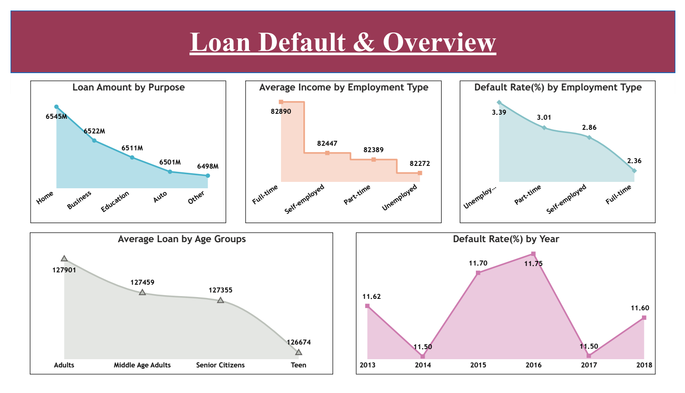
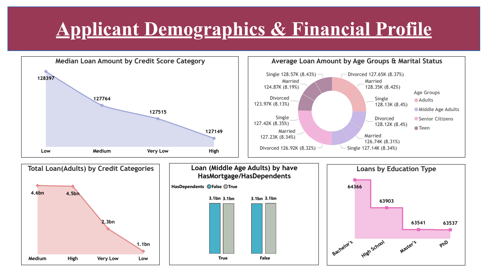
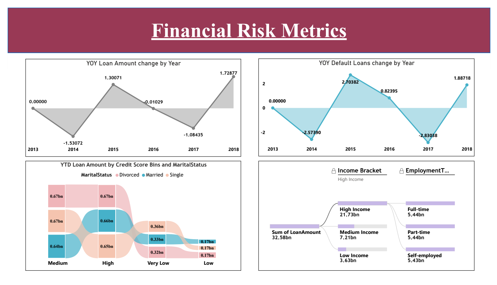

# Loan Default Data Analysis
Power BI | SQL Server | Dataflow | DAX | Data Analytics

## Project Summary
End-to-end loan default analysis project focused on understanding borrower behavior, default risk, and financial trends using a large-scale loan dataset sourced from SQL Server, ingested through Power BI Dataflows, and analyzed in Power BI Desktop & Service.

The project evaluates loan amounts, default rates, income, employment type, credit score categories, age groups, and year-over-year trends to support data-driven financial risk assessment.

### Tools & Technologies
- Power BI Desktop & Power BI Service
- Power BI Dataflows (Gen1)
- SQL Server (On-Premises)
- SQL (Data Validation & Extraction)
- Power Query (ETL & Data Profiling)
- DAX (SUMX, FILTER, CALCULATE, COUNTROWS, DIVIDE, AVERAGEX, MEDIANX, SWITCH, YTD, YOY)

### Data Source
- SQL Server database: Loan
- Table: Loan_default
- ~255K+ loan records
- Data ingested using Power BI Dataflow with scheduled refresh
- Dataset includes borrower demographics, loan details, credit scores, employment, income, and default status

### Key Responsibilities
- Created Power BI Dataflow to ingest SQL Server data
- Configured on-premises data gateway and scheduled refresh
- Performed data profiling (column quality, distribution, profile)
- Created calculated columns (Age Groups, Credit Score Bins, Income Brackets)
- Built advanced DAX measures for financial and risk metrics
- Designed multi-page interactive Power BI dashboards
- Implemented YOY, YTD, Median, and Default Rate calculations
- Validated metrics using Power BI visuals and Excel pivot tables

### Key Metrics & Analysis
- Loan amount by purpose
- Average income by employment type
- Default rate by employment type
- Average loan amount by age group
- Default rate by year
- Median loan amount by credit score category
- YOY loan amount & default rate change
- YTD loan amount by credit score & marital status
- Loan distribution by education, mortgage, dependents, and income bracket

## Report Screenshots (Power BI)

### Loan Default & Overview Dashboard

### Applicant Demographics & Financial Profile Dashboard

### Financial Risk Metrics Dashboard

### Business Insights
- Certain employment types show higher default rates
- Borrowers with lower credit scores have higher default probability
- Loan amounts vary significantly across age groups and income brackets
- YOY analysis highlights periods of increased default risk
- YTD metrics support ongoing financial performance monitoring

### Outcome
Delivered a production-ready Power BI reporting solution using Dataflows and advanced DAX, enabling stakeholders to analyze loan performance, borrower risk, and default trends efficiently.

### Skills Demonstrated
- Financial & Risk Data Analysis
- Power BI Dataflows & Gateway Setup
- Advanced DAX Calculations
- Data Validation & Profiling
- SQL & Relational Databases
- Analytical Storytelling
